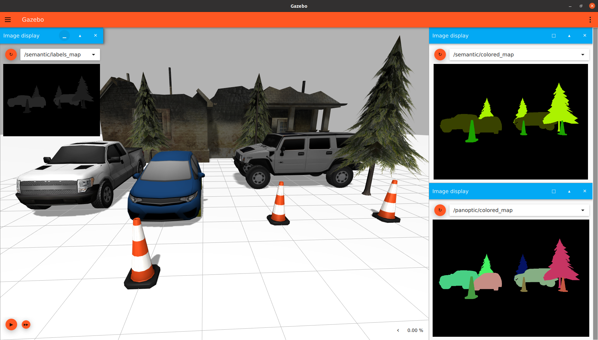

# Segmentation Camera in Ignition Gazebo
In this tutorial, we will discuss how to use a segmentation camera sensor in Ignition Gazebo.

## Requirements

Since this tutorial will show how to use a segmentation camera sensor in Ignition Gazebo, you'll need to have Ignition Gazebo installed. We recommend installing all Ignition libraries, using version Fortress or newer (the segmentation camera is not available in Ignition versions prior to Fortress).
If you need to install Ignition, pick the version you'd like to use and then follow the installation instructions.

## Setting up the segmentation camera
Here's an example of how to attach a segmentation camera sensor to a model in a SDF file:

```xml
    <model name="segmentation_camera">
      <pose>4 0 1.0 0 0.0 3.14</pose>
      <link name="link">
        <pose>0.05 0.05 0.05 0 0 0</pose>
        <inertial>
          <mass>0.1</mass>
          <inertia>
            <ixx>0.000166667</ixx>
            <iyy>0.000166667</iyy>
            <izz>0.000166667</izz>
          </inertia>
        </inertial>
        <collision name="collision">
          <geometry>
            <box>
              <size>0.1 0.1 0.1</size>
            </box>
          </geometry>
        </collision>
        <visual name="visual">
          <geometry>
            <box>
              <size>0.1 0.1 0.1</size>
            </box>
          </geometry>
        </visual>

        <sensor name="segmentation_camera" type="segmentation">
          <topic>segmentation</topic>
          <camera>
            <segmentation_type>instance</segmentation_type>
            <horizontal_fov>1.047</horizontal_fov>
            <image>
              <width>800</width>
              <height>600</height>
            </image>
            <clip>
              <near>0.1</near>
              <far>10</far>
            </clip>
          </camera>
          <always_on>1</always_on>
          <update_rate>30</update_rate>
          <visualize>true</visualize>
        </sensor>
      </link>
    </model>
```

Let’s take a closer look at the portion of the code above that focuses on the segmentation camera sensor:

```xml
        <sensor name="segmentation_camera" type="segmentation">
          <topic>segmentation</topic>
          <camera>
            <segmentation_type>instance</segmentation_type>
            <horizontal_fov>1.047</horizontal_fov>
            <image>
              <width>800</width>
              <height>600</height>
            </image>
            <clip>
              <near>0.1</near>
              <far>10</far>
            </clip>
          </camera>
          <always_on>1</always_on>
          <update_rate>30</update_rate>
          <visualize>true</visualize>
        </sensor>
```

As we can see, we define a sensor with the following SDF elements:
* `<camera>`: The camera, which has the following child elements:
	* `<horizontal_fov>`: The horizontal field of view, in radians.
	* `<image>`: The image size, in pixels.
	* `<clip>`: The near and far clip planes. Objects are only rendered if they're within these planes.
* `<always_on>`: Whether the sensor will always be updated (indicated by 1) or not (indicated by 0). This is currently unused by Ignition Gazebo.
* `<update_rate>`: The sensor's update rate, in Hz.
* `<visualize>`: Whether the sensor should be visualized in the GUI (indicated by true) or not (indicated by false). This is currently unused by Ignition Gazebo.
* `<topic>`: The name of the topic which will be used to publish the sensor data.

<br>
There's also an optional plugin used here that allows for further configuration of the segmentation camera. Here's a description of the elements in this plugin (if the plugin isn't used, the default values mentioned below are used):

`<segmentation_type>`: The type of segmentation, it could be [semantic](https://www.jeremyjordan.me/semantic-segmentation/) segmentation (where each pixel contains the label of the object) or [panoptic / instance](https://hasty.ai/blog/panoptic-segmentation-explained/) segmentation (which is another format of instance segmentation where each pixel contains 3 values: one for the label of the object and two for the instance count of that label)

`<segmentation_type>` available values: `semantic` for semantic segmentation and `panoptic` or `instance` for panoptic segmentation.

Default value for the `<segmentation_type>` is `semantic` or semantic segmentation


#### Label map & Colored map
The segmentation sensor makes 2 types of maps:

- The `label map` which is described above where each pixel contains the label value in semantic segmentation and (label & num of instances) in case of panoptic segmentation
- The `colored map` which is the colored version of the label map, in semantic segmentation each pixel contains the coresponding color to the label of the object, so all items of the same label will have the same color. And in panoptic segmentation, each pixel contains a unique color for each instance in the scene.

## Assigning a label to a model
Only models with labels (annotated classes) will be visible by the segmentation camera sensor, and unlabeled models will be considered as a background

To assign a label to a model we use the label plugin in the SDF file

```xml
<model name="box">
      <pose>0 -1 0.5 0 0 0</pose>
      <link name="box_link">
        <inertial>
          <inertia>
            <ixx>1</ixx>
            <ixy>0</ixy>
            <ixz>0</ixz>
            <iyy>1</iyy>
            <iyz>0</iyz>
            <izz>1</izz>
          </inertia>
          <mass>1.0</mass>
        </inertial>
        <collision name="box_collision">
          <geometry>
            <box>
              <size>1 1 1</size>
            </box>
          </geometry>
        </collision>

        <visual name="box_visual">
          <geometry>
            <box>
              <size>1 1 1</size>
            </box>
          </geometry>
          <material>
            <ambient>0 0 0.5 1</ambient>
            <diffuse>0 0 1 1</diffuse>
            <specular>0 0 0.3 1</specular>
          </material>
          <plugin filename="ignition-gazebo-label-system" name="ignition::gazebo::systems::Label">
            <label>10</label>
          </plugin>
        </visual>
      </link>
    </model>
```

Lets zoom in the label plugin

```xml
          <plugin filename="ignition-gazebo-label-system" name="ignition::gazebo::systems::Label">
            <label>10</label>
          </plugin>
```

We assign the label of the model by adding that plugin to the `<visual>` tag of the model or the `<model>` tag(will be shown below), And we add the `<label>` tag to assign the label class to the model.

The code above is an example for adding the label plugin as a child for the `<visual>` tag.

Example for adding the label plugin as a child for the `<model>` tag

```xml
    <model name="sphere">
      <static>true</static>
      <pose>-1 -2 0.5 0 0 0</pose>
      <link name="sphere_link">
      ...
      </link>
      <plugin filename="ignition-gazebo-label-system" name="ignition::gazebo::systems::Label">
        <label>20</label>
      </plugin>
    </model>
```

Or by including a model from ignition fuel, you can add the label plugin as a child for the <include> tag

```xml
   <include>
      <pose>-1 0 3 0.0 0.0 1.57</pose>
      <uri>
      https://fuel.ignitionrobotics.org/1.0/OpenRobotics/models/Construction Cone
      </uri>
      <plugin filename="ignition-gazebo-label-system" name="ignition::gazebo::systems::Label">
        <label>30</label>
      </plugin>
    </include>
```

## Running an example:
Now that we've discussed how a segmentation camera and models with labels can be specified, let's start with an example world that uses the segmentation camera.
Run the following command:
```
ign gazebo segmentation_camera.sdf
```

You should see something similar to this:
@image html files/segmentation_camera/cars_segmentation.png




There are 2 segmentation cameras in the SDF world, one for semantic segmentation type and another one for instance/panoptic segmentation type:

- The instance/panoptic segmentation sensor which publishes the colored map to `panoptic/colored_map` topic and the labels map to `panoptic/labels_map` topic

```xml
        <sensor name="instance_segmentation_camera" type="segmentation">
          <topic>panoptic</topic>
          <camera>
            <segmentation_type>instance</segmentation_type>
            <horizontal_fov>1.57</horizontal_fov>
            <image>
              <width>800</width>
              <height>600</height>
            </image>
            <clip>
              <near>0.1</near>
              <far>100</far>
            </clip>
            <save enabled="true">
              <path>/home/amrelsersy/Dataset/Instance</path>
            </save>
          </camera>
          <always_on>1</always_on>
          <update_rate>30</update_rate>
          <visualize>true</visualize>
        </sensor>
      </link>
    </model>

```
- The semantic segmentation sensor which publishes the colored map to `semantic/colored_map` topic and the labels map to `semantic/labels_map` topic
```xml
        <sensor name="semantic_segmentation_camera" type="segmentation">
          <topic>semantic</topic>
          <camera>
            <segmentation_type>semantic</segmentation_type>
            <horizontal_fov>1.57</horizontal_fov>
            <image>
              <width>800</width>
              <height>600</height>
            </image>
            <clip>
              <near>0.1</near>
              <far>100</far>
            </clip>
            <save enabled="true">
              <path>/home/amrelsersy/Dataset/Semantic</path>
            </save>
          </camera>
          <always_on>1</always_on>
          <update_rate>30</update_rate>
          <visualize>true</visualize>
        </sensor>

```

Note that the upper right `Image Display` plugin we have the colored map for semantic maps and in the lower `Image Display` plugin we have the label map. The colored map shows that all objects with the same labels (ex: all cars) have the same, and in the upper left `Image Display` plugin the `labels map` they contains the same label value

<br>

Note that the upper right `Image Display` plugin we have the colored map for instance/panoptic segmentation, where each object in the scene has a unique color even the objects with the same label(all cars have the same label but a different color), and its labels map, each pixel has a unique values (1 value for label and 2 values for number of instances of that label)


## Segmentation Dataset Generation
To save the output of the sensor as a segmentation dataset samples we add the `<save>` tag to the `<camera>` tag, And we specify the path to save the dataset in.

```xml
        <sensor name="segmentation_camera" type="segmentation">
          ...
          <camera>
            ...
            <save enabled="true">
              <path>DATSET_PATH</path>
            </save>
          </camera>
        </sensor>
```

Set up the paths of the sensors(there are 2 segmentation sensors in the world for both types semantic and panoptic) and run:
```
ign gazebo segmentation_camera.sdf
```

you will find that the datasets is saved in the given path

#### Dataset Demo
@image html files/segmentation_camera/segmentation_dataset.gif


## Visualize the segmentation dataset via Python
put the following code in a file and run it and give it the path of the saved dataset (the one you specified in the `<save>` tag in the SDF world)
```
python3 file_name.py --path DATASET_PATH
```

```python
import cv2
import argparse
import os
import numpy as np

# Add the colored map to the image for visualization
def add_colored_to_image(image, colored):
    return cv2.addWeighted(cv2.resize(image, (colored.shape[1], colored.shape[0]) )
                            .astype(np.uint8), 1,
                            colored.astype(np.uint8), .5,
                            0, cv2.CV_32F)


# global labels map for mouse callback
labels_map = None

# Callback when you click on any pixel in the labels_map image
# Prints the label and instance count of the clicked pixel
def mouse_callback(event,x,y,flags,param):
    if event == cv2.EVENT_LBUTTONDOWN:
        # instance / panoptic
        # label id
        label = labels_map[y,x,0]

        # instance count from the other 2 values of the pixel
        instance_count = labels_map[y,x,1] * 256 + labels_map[y,x,2]

        print(f'label: {label} .. instance count: {instance_count}')

cv2.namedWindow('labels_map')
cv2.setMouseCallback('labels_map', mouse_callback)

# Arg Parser to set the dataset path
parser = argparse.ArgumentParser()
parser.add_argument('--path', type=str, required=True, help='Segmentation Dataset Path')
args = parser.parse_args()

# dataset path
path = args.path

# paths of images folders
images_path = os.path.join(path, "images")
labels_map_path = os.path.join(path, "labels_maps")
colored_map_path = os.path.join(path, "colored_maps")

# list all images paths
images_names  = sorted(os.listdir(images_path))
labels_names  = sorted(os.listdir(labels_map_path))
colored_names = sorted(os.listdir(colored_map_path))

# add the root path to images names
images_paths      = [os.path.join(images_path, name) for name in images_names]
labels_map_paths  = [os.path.join(labels_map_path, name) for name in labels_names]
colored_map_paths = [os.path.join(colored_map_path, name) for name in  colored_names]

for image_path, labels_path, colored_path in zip(images_paths, labels_map_paths, colored_map_paths):
    image = cv2.imread(image_path, cv2.IMREAD_COLOR)
    labels_map = cv2.imread(labels_path, cv2.IMREAD_COLOR)
    colored_map = cv2.imread(colored_path, cv2.IMREAD_COLOR)

    colored_image = add_colored_to_image(image, colored_map)
    cv2.imshow("segmentation", colored_image)

    cv2.imshow("image", image)
    cv2.imshow("labels_map", labels_map)
    cv2.imshow("colored_map", colored_map)

    print("Press Any Key to Continue ... ESC to exit")
    if cv2.waitKey(0) == 27:
        break


cv2.destroyAllWindows()

```
You will see 4 windows(image + labels_map + colored_map + colored_image(which is a combination of the image and colord_map))


For panoptic/instance segmentation, to parse the `labels_map` click on any pixel of the `labels_map` window to see the `label` and `instance count` of that pixel


## Processing the segmentation sensor via ign-transport
To visualize the output from different SDF file, you can include the model of the sensor in any SDF file then run it via ign gazebo and open the `Image Display` plugin and select the topic you specified in the `<topic>` tag with suffix `colored_map` or `labels_map`.

for example, in the following topic
```xml
    <topic>segmentation</topic>
```
the sensor data will be publish the label map data on `segmentation/labels_map` and will publish the colored map on `segmentation/colored_map`

Taking a look at the [SDF]() file for this example.


Here's an example for segmentation camera subscriber that gets the boxes:
```cpp
#include <cstdint>
#include <ignition/msgs.hh>
#include <ignition/transport.hh>
#include <ignition/rendering.hh>

void OnNewLabelMap(const ignition::msgs::Image &_msg)
{
  auto width = _msg.width();
  auto height = _msg.height();
  auto buffer = _msg.data();

  for (uint32_t i = 0; i < height; i++)
  {
    for (uint32_t j = 0; j < width; j++)
    {
      auto index = (i * width + j) * 3;

      // label id of the pixel
      auto label = buffer[index + 2];

      // in case of semantic segmentation, instance count will contain
      // the same value of the label
      // 16 bit value for instance count
      auto instanceCount1 = buffer[index + 1];
      auto instanceCount2 = buffer[index];
      // get the 16 bit decimal value from the 2 parts of 8 bits
      auto instanceCount = instanceCount1 * 256 + instanceCount2;
    }
  }
}

void OnNewColoredMap(const ignition::msgs::Image &_msg)
{
  auto width = _msg.width();
  auto height = _msg.height();
  auto buffer = _msg.data();

  for (uint32_t i = 0; i < height; i++)
  {
    for (uint32_t j = 0; j < width; j++)
    {
      auto index = (i * width + j) * 3;
      auto r = buffer[index + 2];
      auto g = buffer[index + 1];
      auto b = buffer[index];
    }
  }
}

int main(int argc, char **argv)
{
  ignition::transport::Node node;

  if (!node.Subscribe("/segmentation/colored_map", &OnNewColoredMap) ||
    !node.Subscribe("/segmentation/labels_map", &OnNewLabelMap))
  {
    std::cerr << "Error subscribing to the boundingbox camera topic" << std::endl;
    return -1;
  }

  ignition::transport::waitForShutdown();
  return 0;
}
```

And Its CMakeLists.txt file

```cmake
cmake_minimum_required(VERSION 3.5 FATAL_ERROR)
project(ignition-sensors-camera-demo)

# Find the Ignition Libraries used directly by the example
find_package(ignition-rendering6 REQUIRED OPTIONAL_COMPONENTS ogre ogre2)
find_package(ignition-sensors6 REQUIRED COMPONENTS rendering camera)

if (TARGET ignition-rendering6::ogre)
  add_definitions(-DWITH_OGRE)
endif()
if (TARGET ignition-rendering6::ogre2)
  add_definitions(-DWITH_OGRE2)
endif()

add_executable(segmentation_camera main.cc)
target_link_libraries(segmentation_camera PUBLIC
 ignition-sensors6::camera)

```

To run the code
```cmd
mkdir build
cd build
cmake ..
make
./segmentation_camera
```

