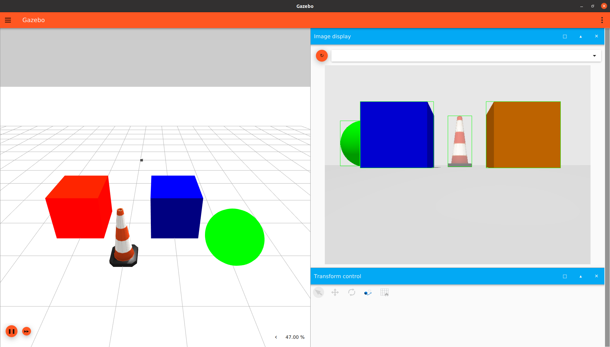
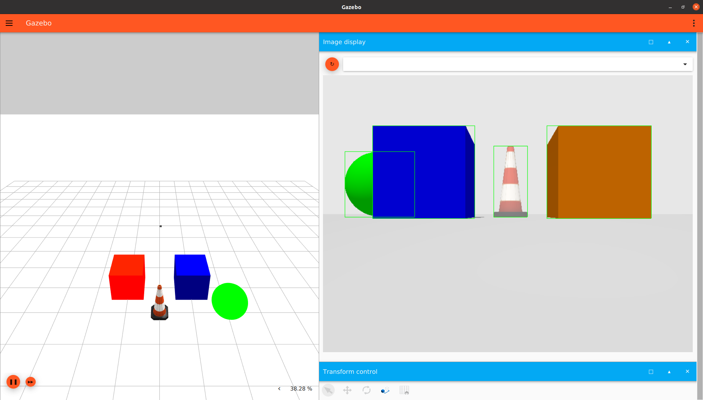
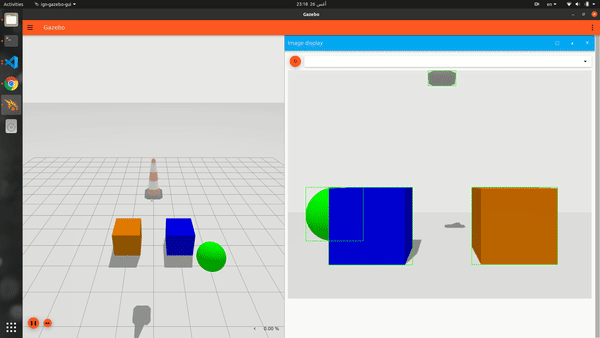
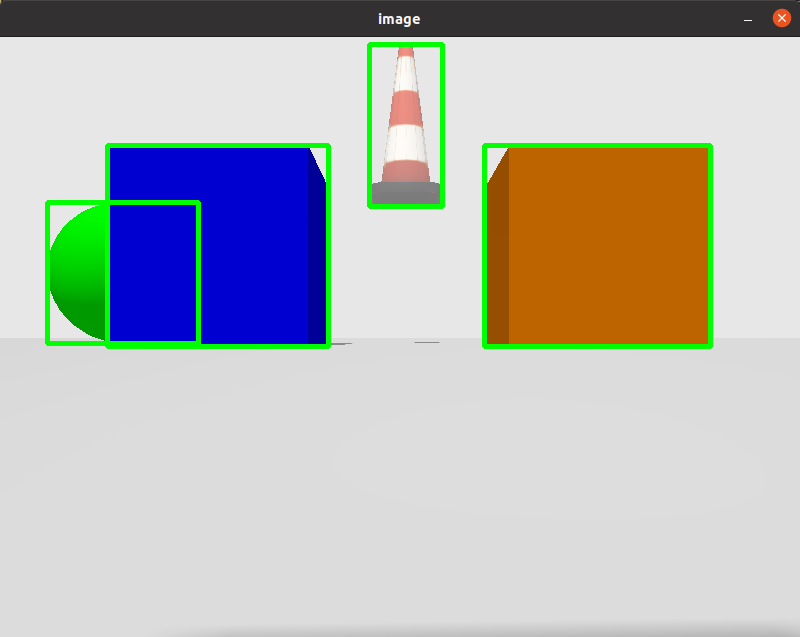
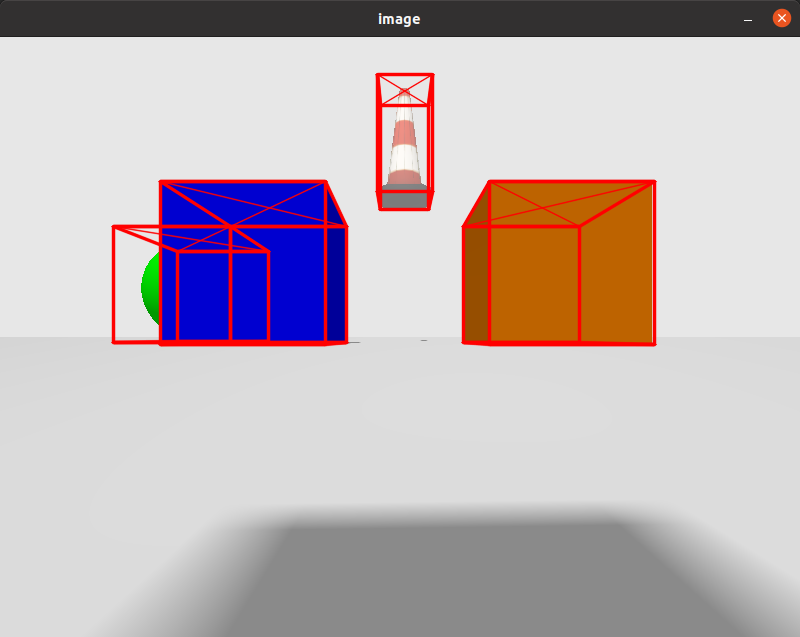

\page boundingbox_camera  Bounding Box Camera in Gazebo
In this tutorial, we will discuss how to use a bounding box camera sensor in Gazebo Sim.

## Requirements

Since this tutorial will show how to use a bounding box camera sensor in Gazebo Sim, you'll need to have Gazebo Sim installed. We recommend installing all Gazebo libraries, using version Fortress or newer (the bounding box camera is not available in Gazebo versions prior to Fortress).
If you need to install Gazebo, pick the version you'd like to use and then follow the installation instructions.

## Setting up the bounding box camera
Here's an example of how to attach a bounding box camera sensor to a model in a SDF file:

```xml
<model name="boundingbox_camera">
     <pose>4 0 1.0 0 0.0 3.14</pose>
     <link name="link">
       <pose>0.05 0.05 0.05 0 0 0</pose>
       <inertial>
         <mass>0.1</mass>
         <inertia>
           <ixx>0.000166667</ixx>
           <iyy>0.000166667</iyy>
           <izz>0.000166667</izz>
         </inertia>
       </inertial>
       <collision name="collision">
         <geometry>
           <box>
             <size>0.1 0.1 0.1</size>
           </box>
         </geometry>
       </collision>
       <visual name="visual">
         <geometry>
           <box>
             <size>0.1 0.1 0.1</size>
           </box>
         </geometry>
       </visual>

       <sensor name="boundingbox_camera" type="boundingbox_camera">
         <topic>boxes</topic>
         <camera>
           <box_type>2d</box_type>
           <horizontal_fov>1.047</horizontal_fov>
           <image>
             <width>800</width>
             <height>600</height>
           </image>
           <clip>
             <near>0.1</near>
             <far>10</far>
           </clip>
         </camera>
         <always_on>1</always_on>
         <update_rate>30</update_rate>
         <visualize>true</visualize>
       </sensor>
     </link>
   </model>
```
Let’s take a closer look at the portion of the code above that focuses on the bounding box camera sensor:

```xml
<sensor name="boundingbox_camera" type="boundingbox_camera">
         <topic>boxes</topic>
         <camera>
           <box_type>2d</box_type>
           <horizontal_fov>1.047</horizontal_fov>
           <image>
             <width>800</width>
             <height>600</height>
           </image>
           <clip>
             <near>0.1</near>
             <far>10</far>
           </clip>
         </camera>
         <always_on>1</always_on>
         <update_rate>30</update_rate>
         <visualize>true</visualize>
       </sensor>
```

As we can see, we define a sensor with the following SDF elements:
* `<box_type>`: The type of bounding boxes, boxes can be 2d or 3d, and 2d boxes can be visible 2d boxes or full 2d boxes
    * Visible 2d box: 2D axis aligned box that shows the visible part of the occluded object
    * Full 2d box: 2D axis aligned box that shows the full box of occluded objects
    * 3D box: Oriented 3D box defined by the center position / orientation / size
    The default value is Visible 2d box.
    The `<box_type>` values can be
    - For visible 2d boxes: `2d`, `visible_2d`, “`visible_box_2d`
    - For full 2d boxes: `full_2d`, “`visible_box_2d`
    - For 3d boxes: `3d`
* `<camera>`: The camera, which has the following child elements:
  	* `<horizontal_fov>`: The horizontal field of view, in radians.
  	* `<image>`: The image size, in pixels.
  	* `<clip>`: The near and far clip planes. Objects are only rendered if they're within these planes.
* `<always_on>`: Whether the sensor will always be updated (indicated by 1) or not (indicated by 0). This is currently unused by Gazebo Sim.
* `<update_rate>`: The sensor's update rate, in Hz.
* `<visualize>`: Whether the sensor should be visualized in the GUI (indicated by true) or not (indicated by false). This is currently unused by Gazebo Sim.
* `<topic>`: The name of the topic where sensor data is published.

<br>


## Assigning a label to a model
Only models with labels (annotated classes) will be visible by the bounding box camera sensor, and unlabeled models will be considered as a background

To assign a label to a model we use the label plugin in the SDF file

```xml
<model name="box">
      <pose>0 -1 0.5 0 0 0</pose>
      <link name="box_link">
        <inertial>
          <inertia>
            <ixx>1</ixx>
            <ixy>0</ixy>
            <ixz>0</ixz>
            <iyy>1</iyy>
            <iyz>0</iyz>
            <izz>1</izz>
          </inertia>
          <mass>1.0</mass>
        </inertial>
        <collision name="box_collision">
          <geometry>
            <box>
              <size>1 1 1</size>
            </box>
          </geometry>
        </collision>

        <visual name="box_visual">
          <geometry>
            <box>
              <size>1 1 1</size>
            </box>
          </geometry>
          <material>
            <ambient>0 0 0.5 1</ambient>
            <diffuse>0 0 1 1</diffuse>
            <specular>0 0 0.3 1</specular>
          </material>
          <plugin filename="gz-sim-label-system" name="gz::sim::systems::Label">
            <label>10</label>
          </plugin>
        </visual>
      </link>
    </model>
```

Lets zoom in the label plugin

```xml
          <plugin filename="gz-sim-label-system" name="gz::sim::systems::Label">
            <label>10</label>
          </plugin>
```

We assign the label of the model by adding that plugin to the `<visual>` tag of the model or the `<model>` tag(will be shown below), And we add the `<label>` tag to assign the label class to the model.

The code above is an example for adding the label plugin as a child for the `<visual>` tag.

Example for adding the label plugin as a child for the `<model>` tag

```xml
    <model name="sphere">
      <static>true</static>
      <pose>-1 -2 0.5 0 0 0</pose>
      <link name="sphere_link">
      ...
      </link>
      <plugin filename="gz-sim-label-system" name="gz::sim::systems::Label">
        <label>20</label>
      </plugin>
    </model>
```

Or by including a model from gz fuel, you can add the label plugin as a child for the <include> tag

```xml
   <include>
      <pose>-1 0 3 0.0 0.0 1.57</pose>
      <uri>
      https://fuel.gazebosim.org/1.0/OpenRobotics/models/Construction Cone
      </uri>
      <plugin filename="gz-sim-label-system" name="gz::sim::systems::Label">
        <label>30</label>
      </plugin>
    </include>
```

## Running an example:
Now that we've discussed how a bounding box camera and models with labels can be specified, let's start with an example world that uses the bounding box camera.
Run the following command:
```
gz sim boundingbox_camera.sdf
```

You should see something similar to this:




Note that the mode was visible 2d, so that the occluded sphere has a bounding box on just the visible part of it, that is the way of the annotation in famous datasets such as COCO & PASCAL VOC datasets.


Change the `<box_type>` to `full_2d` to see the full bounding boxes mode which shows the full box of the occluded objects, and this mode is implemented in datasets such as `KITTI` and `nuscenes`, and it is benefit in the case that you need a the model to guess the hidden parts of the objects!.

You will see output like this:




To visualize the output from different SDF file, you can include the model of the sensor in any SDF file then run it via gz sim and open the `Image Display` plugin and select the topic you specified in the `<topic>` tag.


Taking a look at the [SDF](https://github.com/gazebosim/gz-sim/blob/gz-sensors10/examples/worlds/boundingbox_camera.sdf) file for this example.


## Object Detection Dataset Generation
To save the output of the sensor as an object detection dataset samples we add the `<save>` tag to the `<camera>` tag, And we specify the path to save the dataset in.

```xml
        <sensor name="boundingbox_camera" type="boundingbox">
          ...
          <camera>
            ...
            <save enabled="true">
              <path>DATSET_PATH</path>
            </save>
          </camera>
        </sensor>
```

Set up the path of the dataset and run:
```
gz sim boundingbox_camera.sdf
```

you will find that the dataset is saved in the given path

### Dataset Demo




## Visualize the dataset in Python

To visualize the dataset after the generation, put that code in a `.py` file then run:
```
python3 file_name.py --path DATASET_PATH
```
the `DATASET_PATH` is the save path where the dataset is saved(the one you specified in the `<save>` tag)

```python
import cv2
import numpy as np
import os
import argparse

# Arg Parser to set the dataset path
parser = argparse.ArgumentParser()
parser.add_argument('--path', type=str, required=True, help='Segmentation Dataset Path')
args = parser.parse_args()

# dataset path
path = args.path

# paths of images folders
imageDir = os.path.join(path, "images")
boxesDir = os.path.join(path, "boxes")

imagesPaths = sorted(os.listdir(imageDir))
boxesPaths = sorted(os.listdir(boxesDir))

imagesPaths = [os.path.join(imageDir, path) for path in imagesPaths]
boxesPaths = [os.path.join(boxesDir, path) for path in boxesPaths]

for imagePath, boxesPath in zip(imagesPaths, boxesPaths):
    boxesFile = open(boxesPath)
    boxesLines = boxesFile.readlines()

    image = cv2.imread(imagePath)
    width, height = image.shape[1], image.shape[0]

    del boxesLines[0]
    for box in boxesLines:
        box = box.split(',')
        label = float(box[0])
        x     = float(box[1])
        y     = float(box[2])
        w     = float(box[3])
        h     = float(box[4])

        cv2.rectangle(image, (int(x-w/2), int(y-h/2)), (int(x+w/2), int(y+h/2)), (0,255,0), 3)

    print("")
    cv2.imshow("image", image)
    if cv2.waitKey(0) == 27:
        cv2.destroyAllWindows()
        break

```

You will see output like this



Try to change the `<box_type>` to `3d` then generate the dataset again, then visualize it using the following code

```python
import cv2
import numpy as np
import os
import argparse

def draw_box_3d(image, corners, color=(0, 0, 255)):
    ''' Draw 3d bounding box in image
        corners: (8,2) array of vertices for the 3d box in following order:
            1 -------- 0
           /|         /|
          2 -------- 3 .
          | |        | |
          . 5 -------- 4
          |/         |/
          6 -------- 7
    '''

    face_idx = [[0, 1, 5, 4],
                [1, 2, 6, 5],
                [2, 3, 7, 6],
                [3, 0, 4, 7]]
    for ind_f in range(3, -1, -1):
        f = face_idx[ind_f]
        for j in range(4):
            cv2.line(image, (corners[f[j], 0], corners[f[j], 1]),
                     (corners[f[(j + 1) % 4], 0], corners[f[(j + 1) % 4], 1]), color, 2, lineType=cv2.LINE_AA)
        if ind_f == 0:
            cv2.line(image, (corners[f[0], 0], corners[f[0], 1]),
                     (corners[f[2], 0], corners[f[2], 1]), color, 1, lineType=cv2.LINE_AA)
            cv2.line(image, (corners[f[1], 0], corners[f[1], 1]),
                     (corners[f[3], 0], corners[f[3], 1]), color, 1, lineType=cv2.LINE_AA)

    return image

# Calculates Rotation Matrix given euler angles.
def euler_to_rotation(theta) :

    R_x = np.array([[1,         0,                  0                   ],
                    [0,         np.cos(theta[0]), -np.sin(theta[0]) ],
                    [0,         np.sin(theta[0]),  np.cos(theta[0])  ]
                    ])

    R_y = np.array([[np.cos(theta[1]),    0,      np.sin(theta[1])  ],
                    [0,                   1,      0                   ],
                    [-np.sin(theta[1]),   0,      np.cos(theta[1])  ]
                    ])

    R_z = np.array([[np.cos(theta[2]),    -np.sin(theta[2]),    0],
                    [np.sin(theta[2]),     np.cos(theta[2]),     0],
                    [0,                     0,                      1]
                    ])

    R = np.dot(R_z, np.dot( R_y, R_x ))

    return R
"""
This matrix are specific for the camera configuration in the SDF world

    <horizontal_fov>1.57</horizontal_fov>
    <width>800</width>
    <height>600</height>

If any of them is changed, you have to change the projection matrix
"""
projMatrix = np.array([
    [0.99975, 0, 0, 0],
    [0, 1.333, 0, 0 ],
    [0, 0, -1.00002, -0.02],
    [0, 0, -1, 0]
])


# Arg Parser to set the dataset path
parser = argparse.ArgumentParser()
parser.add_argument('--path', type=str, required=True, help='Segmentation Dataset Path')
args = parser.parse_args()

# dataset path
path = args.path

# paths of images folders
imageDir = os.path.join(path, "images")
boxesDir = os.path.join(path, "boxes")

imagesPaths = sorted(os.listdir(imageDir))
boxesPaths = sorted(os.listdir(boxesDir))

imagesPaths = [os.path.join(imageDir, path) for path in imagesPaths]
boxesPaths = [os.path.join(boxesDir, path) for path in boxesPaths]

for imagePath, boxesPath in zip(imagesPaths, boxesPaths):
    boxesFile = open(boxesPath)
    boxesLines = boxesFile.readlines()

    image = cv2.imread(imagePath)
    width, height = image.shape[1], image.shape[0]

    del boxesLines[0]
    for box in boxesLines:
        box = box.split(',')
        label = float(box[0])
        x     = float(box[1])
        y     = float(box[2])
        z     = float(box[3])
        w     = float(box[4])
        h     = float(box[5])
        l     = float(box[6])
        roll  = float(box[7])
        pitch = float(box[8])
        yaw   = float(box[9])

        # get the rotation matrix
        R = euler_to_rotation([roll, pitch, yaw])

        # get the 8 vertices of the box (the corners) in model coordinates
        x_corners = [w / 2, -w / 2, -w / 2, w / 2, w / 2, -w / 2, -w / 2, w / 2]
        y_corners = [h/2, h/2, h/2, h/2, -h/2, -h/2, -h/2, -h/2]
        z_corners = [l / 2, l / 2, -l / 2, -l / 2, l / 2, l / 2, -l / 2, -l / 2]
        # concatinate them
        corners = np.array([x_corners, y_corners, z_corners], dtype=np.float32)

        # transform the corners to the 3D camera coordinates by applying the rotation then addin the position
        corners_3d = np.dot(R, corners)
        corners_3d = corners_3d + np.array([x,y,z], dtype=np.float32).reshape(3, 1)
        corners_3d = corners_3d.transpose(1, 0)

        # convert the 3d points to 4d homogenous points to apply the projection matrix
        pts_3d_homo = np.concatenate([corners_3d, np.ones((corners_3d.shape[0], 1), dtype=np.float32)], axis=1)

        # projection
        pts_2d = np.dot(projMatrix, pts_3d_homo.transpose(1, 0)).transpose(1, 0)
        # devide by w component of the homogenous coord.
        pts_2d = pts_2d[:, :2] / pts_2d[:, 2:]
        pts_2d = pts_2d.astype(np.float32)

        # convert from [-1,1] to [0,1] range
        pts_2d = pts_2d.clip(-1,1)
        xx = (pts_2d[:,0] + 1) / 2
        yy = (1 - pts_2d[:,1]) / 2
        xx = xx.clip(0,1)
        yy = yy.clip(0,1)
        # convert to screen coord
        pts_2d = np.array([xx,yy], dtype=np.float32).T
        pts_2d *= (width, height)
        pts_2d = pts_2d.astype(np.int32)

        image = draw_box_3d(image, pts_2d)


    print("")
    cv2.imshow("image", image)
    if cv2.waitKey(0) == 27:
        cv2.destroyAllWindows()
        break
```
Note that, you shouldn't change the camera configuration to use that code, or you have to change the porjection matrix that is specified in the code.

You should see output like this




## Processing the bounding box sensor via gz-transport
In the example above, the bounding box cameras publish an axis aligned 2d bounding box message in case of 2d boxes mode (visible 2d or full 2d) or a oriented 3d bounding box message  to the topic provided in the `<topic>` tag in SDF
For example, in the next code we publish on the topic “boxes”

```xml
      <sensor name="boundingbox_camera" type="boundingbox_camera">
         <topic>boxes</topic>
	    ....
```
The camera also publishes an image message of an image with the bounding boxes drawn on it(not valid in case of 3d boxes), and it publish it on topic “TOPIC_TAG_NAME_image”, for example, in the above code, it will publish the image message on “boxes_image”.

We can see the bounding boxes by running the following command:
```gz topic -e -t TOPIC_TAG_NAME```
In the above example, it will be:
```gz topic -e -t boxes```


Here's an example for bounding box camera subscriber that gets the boxes:
```cpp
#include <cstdint>
#include <gz/msgs.hh>
#include <gz/transport.hh>

// a callback function that is triggered whenever the bounding box camera
// topic receives a new 2d boxes message
void OnNewBoxes2D(const gz::msgs::AnnotatedAxisAligned2DBox_V &_msg)
{
 int size = _msg.annotated_box_size();
 std::cout << "Reveived [" << size << "] 2D bounding boxes: " << std::endl;
 for (int i = 0; i < size; i++)
 {
   gz::msgs::AnnotatedAxisAligned2DBox annotatedBox = _msg.annotated_box(i);
   std::cout << annotatedBox.DebugString() << std::endl;
 }
 std::cout << std::endl;
}

// a callback function that is triggered whenever the bounding box camera
// topic receives a new 3d boxes message
void OnNewBoxes3D(const gz::msgs::AnnotatedOriented3DBox_V &_msg)
{
 int size = _msg.annotated_box_size();
 std::cout << "Reveived [" << size << "] 3D bounding boxes: " << std::endl;
 for (int i = 0; i < size; i++)
 {
   gz::msgs::AnnotatedOriented3DBox annotatedBox = _msg.annotated_box(i);
   std::cout << annotatedBox.DebugString() << std::endl;
 }
 std::cout << std::endl;
}

int main(int argc, char **argv)
{
 gz::transport::Node node;
 bool subscribed = false;

 if (argc > 1)
 {
   std::string is3D = argv[1];
   if (is3D == "3d")
     subscribed = node.Subscribe("/boxes", &OnNewBoxes3D);
 }
 else
 {
   subscribed = node.Subscribe("/boxes", &OnNewBoxes2D);
 }
 if (!subscribed)
 {
   std::cerr << "Error subscribing to the boundingbox camera topic" << std::endl;
   return -1;
 }

 gz::transport::waitForShutdown();
 return 0;
}
```
To run the sensor in 3d boxes mode, give it argument `3d`, for example: `./executable_name 3d`


And Its CMakeLists.txt file

```cmake
cmake_minimum_required(VERSION 3.5 FATAL_ERROR)
project(gz-sensors-camera-demo)

# Find the Gazebo Libraries used directly by the example
find_package(gz-rendering6 REQUIRED OPTIONAL_COMPONENTS ogre ogre2)
find_package(gz-sensors6 REQUIRED COMPONENTS rendering camera)

if (TARGET gz-rendering6::ogre)
  add_definitions(-DWITH_OGRE)
endif()
if (TARGET gz-rendering6::ogre2)
  add_definitions(-DWITH_OGRE2)
endif()

add_executable(boundingbox_camera main.cc)
target_link_libraries(boundingbox_camera PUBLIC
 gz-sensors6::camera)

```
